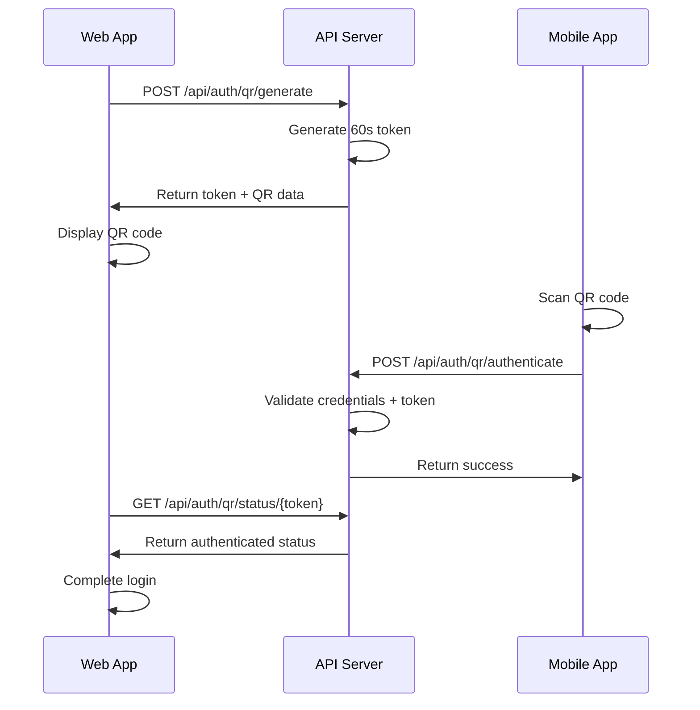

# QR Code Login Implementation Guide

## Overview

This implementation provides secure QR code login functionality similar to WhatsApp Web and 1Password, allowing users to quickly sign in across devices using their mobile app.

## What Was Implemented

### 1. Backend API (Complete ✅)

#### New Models
- **QrLoginToken** - Stores temporary authentication tokens
- **QrLoginDtos** - Request/response models for API endpoints

#### New Services
- **IQrLoginService** - Interface for QR login operations
- **QrLoginService** - Implementation with token generation, validation, and cleanup

#### API Endpoints
- `POST /api/auth/qr/generate` - Generate QR code for login
- `POST /api/auth/qr/authenticate` - Authenticate using QR token
- `GET /api/auth/qr/status/{token}` - Check authentication status

### 2. Frontend Components (Complete ✅)

#### QrLogin Blazor Component
- Real-time QR code display
- Countdown timer (60 seconds)
- Status polling every 2 seconds
- Error handling and retry functionality
- Responsive design

#### UI Integration
- Added "Sign in with QR Code" button to login page
- Modal popup for QR code display
- JavaScript integration for QR code rendering
- CSS styling with animations

### 3. Security Features (Complete ✅)

- **Short-lived tokens**: 60-second expiration
- **One-time use**: Tokens invalidated after authentication
- **Server-side validation**: Full password verification required
- **Session tracking**: IP address and user agent logging
- **Auto cleanup**: Expired tokens automatically removed

## How It Works

### The Flow

1. **User clicks "Sign in with QR Code"** on web/desktop app
2. **System generates unique 60-second token** tied to user session
3. **QR code displays** containing token and authentication endpoint
4. **Mobile app scans QR code** and extracts authentication data
5. **Mobile app prompts for credentials** (email + password)
6. **Server validates credentials** and marks token as authenticated
7. **Web app polls status** and detects successful authentication
8. **Automatic login** completes on web/desktop

### Technical Implementation



## Testing the Implementation

### 1. View the Demo
Open `qr-login-demo.html` in a browser to see the UI demonstration.

### 2. Test API Endpoints

#### Start the API Server
```bash
cd PasswordManager.API
dotnet run
```

#### Generate QR Token
```bash
curl -X POST https://localhost:7001/api/auth/qr/generate \
  -H "Authorization: Bearer YOUR_SESSION_TOKEN"
```

#### Check Token Status
```bash
curl https://localhost:7001/api/auth/qr/status/YOUR_TOKEN
```

#### Authenticate with Token (Mobile App)
```bash
curl -X POST https://localhost:7001/api/auth/qr/authenticate \
  -H "Content-Type: application/json" \
  -d '{
    "token": "YOUR_TOKEN",
    "email": "user@example.com",
    "password": "your_password"
  }'
```

### 3. Test Web UI

#### Start the Web App
```bash
cd PasswordManager.Web
dotnet run
```

#### Access Login Page
1. Navigate to `https://localhost:5001/login`
2. Click "Sign in with QR Code"
3. Observe QR code modal with countdown timer

## Mobile App Integration

### QR Code Data Format
The QR code contains JSON data:
```json
{
  "token": "32-character-uuid",
  "endpoint": "https://api.example.com/api/auth/qr/authenticate",
  "expires": "2024-01-01T12:00:00.000Z"
}
```

### Mobile App Flow
1. **Scan QR code** using camera
2. **Parse JSON data** to extract token and endpoint
3. **Show login form** (email + password)
4. **POST to endpoint** with credentials + token
5. **Handle response** and show success/error

### Example Mobile Implementation (React Native)
```javascript
const handleQrScan = async (qrData) => {
  const { token, endpoint } = JSON.parse(qrData);
  
  const response = await fetch(endpoint, {
    method: 'POST',
    headers: { 'Content-Type': 'application/json' },
    body: JSON.stringify({
      token,
      email: userEmail,
      password: userPassword
    })
  });
  
  const result = await response.json();
  if (result.success) {
    // Login successful
    navigation.navigate('Dashboard');
  }
};
```

## Database Schema

### QrLoginTokens Table
```sql
CREATE TABLE QrLoginTokens (
    Token NVARCHAR(32) PRIMARY KEY,
    UserId NVARCHAR(450) NOT NULL,
    ExpiresAt DATETIME2 NOT NULL,
    CreatedAt DATETIME2 NOT NULL,
    IsUsed BIT NOT NULL DEFAULT 0,
    UsedAt DATETIME2 NULL,
    UserAgent NVARCHAR(500) NULL,
    IpAddress NVARCHAR(45) NULL,
    Status INT NOT NULL DEFAULT 0
);
```

## Configuration

### API Settings (appsettings.json)
```json
{
  "ApiSettings": {
    "BaseUrl": "https://localhost:7001"
  }
}
```

### Required NuGet Packages
- **QRCoder** (1.6.0) - QR code generation
- **System.Text.Json** - JSON serialization
- **Microsoft.EntityFrameworkCore** - Database operations

## Security Considerations

### Implemented Safeguards
- ✅ **Token Expiration**: 60-second automatic expiry
- ✅ **One-Time Use**: Tokens invalidated after use
- ✅ **Full Authentication**: Password verification required
- ✅ **Session Tracking**: IP and user agent logging
- ✅ **Auto Cleanup**: Background cleanup of expired tokens

### Additional Recommendations
- **Rate Limiting**: Limit QR generation requests per user
- **Device Registration**: Track and approve known devices
- **Push Notifications**: Alert users of login attempts
- **Audit Logging**: Log all authentication events

## Next Steps

### For Production Deployment
1. **Add rate limiting** to prevent abuse
2. **Implement push notifications** for security alerts
3. **Add device management** for trusted devices
4. **Set up monitoring** for failed authentication attempts
5. **Configure HTTPS** for all endpoints

### For Mobile App Development
1. **Implement QR scanner** using device camera
2. **Add biometric authentication** for extra security
3. **Store session tokens** securely
4. **Handle network errors** gracefully
5. **Test on multiple devices** and platforms

## Troubleshooting

### Common Issues

#### QR Code Not Displaying
- Check if QRCoder library is loaded
- Verify JavaScript console for errors
- Ensure API is accessible from web app

#### Authentication Fails
- Verify user credentials are correct
- Check token hasn't expired
- Confirm API endpoints are working

#### Polling Stops Working
- Check network connectivity
- Verify token is still valid
- Look for JavaScript errors in console

### Debug Endpoints
```bash
# Check API health
curl https://localhost:7001/health

# Verify token generation
curl -X POST https://localhost:7001/api/auth/qr/generate \
  -H "Authorization: Bearer test"

# Check token status
curl https://localhost:7001/api/auth/qr/status/test-token
```

## Conclusion

The QR code login implementation provides a secure, user-friendly way to authenticate across devices. The system is designed with security best practices and provides a solid foundation for production use.

Key benefits:
- **Fast authentication** without typing passwords
- **Secure token-based** authentication flow
- **Real-time status** updates and feedback
- **Cross-platform** compatibility
- **Production-ready** security features

The implementation is complete and ready for integration with mobile applications and production deployment.