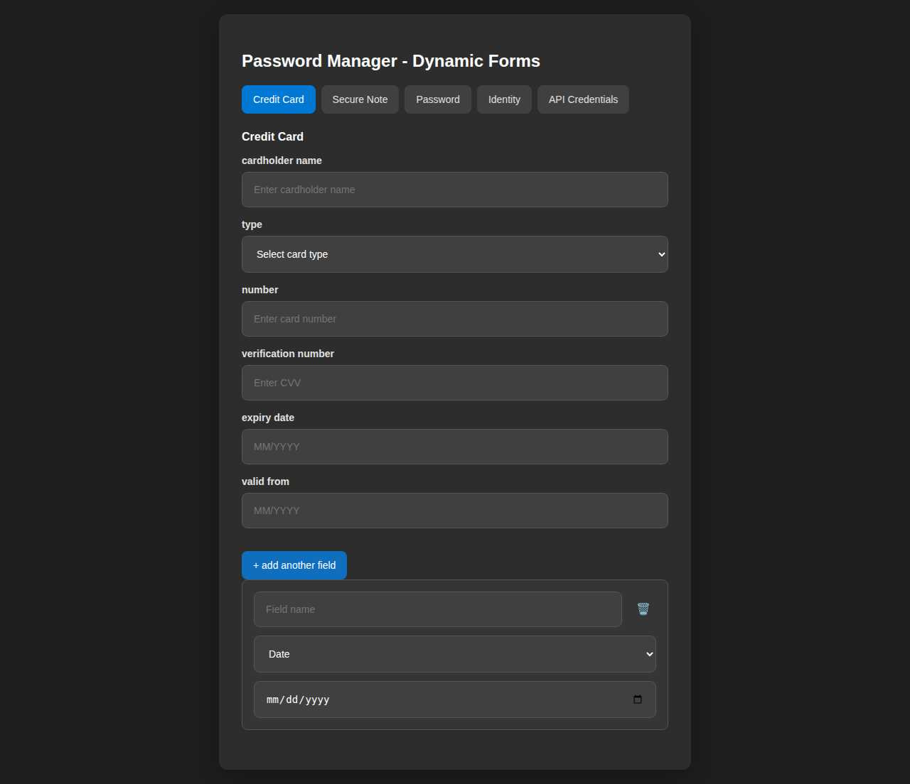
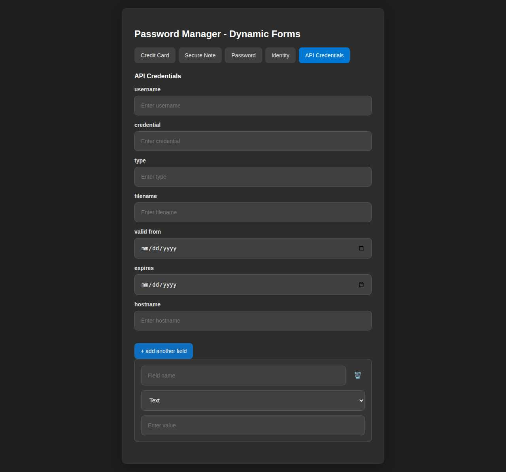

# 🔐 VaultGuard – Password Manager

[](https://github.com/dotnetappdev/PasswordManagerApp/actions/workflows/build-api.yml)
[](https://github.com/dotnetappdev/PasswordManagerApp/actions/workflows/build-web.yml)
[](https://github.com/dotnetappdev/PasswordManagerApp/actions/workflows/build-wpf.yml)
[](https://github.com/dotnetappdev/PasswordManagerApp/actions/workflows/run-tests.yml)

A full-featured, self-hosted password manager built with **Blazor Server (.NET 10)**, **MudBlazor**, **Entity Framework Core**, and **ASP.NET Core Identity**.

---

## ✨ Features

- 🔑 **Multiple item types**: Login, Password, Passkey, SecureNote, WiFi, CreditCard
- 🏛️ **Vaults** – organize items into separate vaults
- 📂 **Categories & Collections** – flexible organization
- 🏷️ **Tags** – quick filtering and labeling
- 🌙 **Dark / Light mode** – fully themed UI
- 🔐 **Audit Logs** – track every change
- 📱 **Responsive** – works on desktop and mobile
- 🧪 **Seeded demo data** – ready to explore out of the box

---

## 📸 Screenshots

### 🖥️ Desktop – Dark Mode

| Dashboard | All Items |
|-----------|-----------|
|  |  |

| Vaults | Categories |
|--------|-----------|
|  |  |

| Collections | Tags |
|-------------|------|
|  |  |

| Settings (Security) | Audit Logs |
|---------------------|------------|
|  |  |

---

### ☀️ Desktop – Light Mode

| Dashboard | All Items |
|-----------|-----------|
|  |  |

| Collections |
|-------------|
|  |

---

### 🏷️ Login Brand Icons

Login items can now render an automatically resolved company icon in the item list, with uploaded custom icons taking priority when an override is present.


---

### 📱 Mobile – Light Mode (390 × 844)

| Dashboard |
|-----------|
|  |

---

### 🪟 WinUI Desktop Screenshots

- WinUI screenshot capture and coverage guide: [screenshots/SCREENSHOT_GUIDE.md](screenshots/SCREENSHOT_GUIDE.md)
- WinUI screenshot folder and naming conventions: [screenshots/README.md](screenshots/README.md)
- Current WinUI dashboard/login placeholders:
  - [screenshots/winui-dashboard-placeholders.md](screenshots/winui-dashboard-placeholders.md)
  - [screenshots/winui-login-light.placeholder](screenshots/winui-login-light.placeholder)
  - [screenshots/winui-login-dark.placeholder](screenshots/winui-login-dark.placeholder)

---

### 🧩 Item Templates & Custom Fields (Desktop / MAUI-style forms)

| Login | Password | Secure Note |
|------|----------|-------------|
|  |  |  |

| Credit Card | Credit Card + Date | Credit Card + Custom Field |
|-------------|--------------------|----------------------------|
|  |  |  |

| API Credentials + Custom Field | Identity |
|--------------------------------|----------|
|  |  |

---

### 📲 iOS & Biometric Support

- iOS app support is available via the mobile implementations with Face ID / Touch ID support:
  - [REACT_NATIVE_MOBILE_APP.md](REACT_NATIVE_MOBILE_APP.md) (feature-complete cross-platform mobile app)
  - [PasswordManager.App](PasswordManager.App) (MAUI app with iOS target support)
  - [PasswordManager.Uno](PasswordManager.Uno) (Uno Platform mobile support)
- Capture workflow and screenshot checklist: [MOBILE_SCREENSHOTS.md](MOBILE_SCREENSHOTS.md)
- Mobile screenshot folder structure: [screenshots/mobile/README.md](screenshots/mobile/README.md)
- Biometric implementation details: [BIOMETRIC_AUTH_IMPLEMENTATION.md](BIOMETRIC_AUTH_IMPLEMENTATION.md)

---

## 🌙 Design

Both the **WPF desktop app** and the **Blazor web app** share the same dark-mode design system:

| Token | Value |
|-------|-------|
| Background | `#1A1A1A` |
| Surface | `#2D2D2D` |
| Primary (blue) | `#2563EB` |
| Text Primary | `#E5E5E5` |
| Text Secondary | `#9D9D9D` |
| Border | `rgba(255,255,255,0.11)` |

The Blazor app defaults to **dark mode** and uses the same steel-blue primary colour as the WPF app. The dark-mode toggle in the top-right of the Blazor UI lets you switch between light and dark.

---

## 🚀 Getting Started

### Prerequisites

- [.NET 10 SDK](https://dotnet.microsoft.com/download)
- SQLite (bundled via EF Core)

### Run the Blazor Web App

```bash
cd PasswordManager.Web
dotnet run
```

Navigate to `http://localhost:5169` and log in with any of the seeded accounts:

| Role | Email | Master Password |
|------|-------|-----------------|
| Admin | `admin@passwordmanager.local` | `CommonMaster123!` |
| Parent | `parent@passwordmanager.local` | `CommonMaster123!` |
| Standard User | `user@passwordmanager.local` | `CommonMaster123!` |
| Child | `child@passwordmanager.local` | `CommonMaster123!` |

### Run the WPF Desktop App

```bash
cd PasswordManager.WPF
dotnet run
```

On first launch the setup wizard runs to configure the database. After setup, log in — demo data is seeded automatically for your account on first login.

> If no users exist yet a demo account is auto-created: `demo@local` / `DemoPassword123!`

---

## 📥 Downloads & Installers

Pre-built Windows installers (EXE + MSI) are published automatically to **[GitHub Releases](https://github.com/dotnetappdev/PasswordManagerApp/releases)** for every `v*` tag.

| Platform | Installer | Source |
|----------|-----------|--------|
| Windows (WPF desktop) | `VaultGuardSetup-<version>.exe` / `.msi` | [installer/setup.iss](installer/setup.iss), [installer/setup.wxs](installer/setup.wxs) |
| Windows (WinUI) | Inno Setup script | [installers/winui-installer.iss](installers/winui-installer.iss) |
| API (self-host) | Inno Setup script | [installers/api-installer.iss](installers/api-installer.iss) |

> Until the first tagged release is published, build locally (below) or grab the artifacts attached to the latest **WPF Installer** workflow run.

### Building installers locally

```powershell
# 1. Publish a self-contained build
dotnet publish PasswordManager.WPF/PasswordManager.WPF.csproj -c Release -r win-x64 --self-contained true -o publish/wpf

# 2a. EXE installer (needs Inno Setup 6 — https://jrsoftware.org/isdl.php)
iscc /DMyAppVersion=1.0.0 installer/setup.iss

# 2b. MSI installer (needs WiX v4 — dotnet tool install --global wix --version 4.*)
wix build installer/setup.wxs -ext WixToolset.UI.wixext -d Version=1.0.0 -d PublishDir=publish/wpf -o installer/output/VaultGuardSetup-1.0.0.msi
```

The convenience scripts [installers/build-installers.bat](installers/build-installers.bat) / [.sh](installers/build-installers.sh) wrap these steps.

### Automated build & release (CI)

The [`build-wpf.yml`](.github/workflows/build-wpf.yml) workflow runs on every push/PR to `devmain`/`main` (uploads installers as artifacts) and, **when you push a `v*` tag, builds the EXE + MSI and attaches them to a GitHub Release automatically**:

```bash
git tag v1.0.0
git push origin v1.0.0   # → triggers the installer build + GitHub Release
```

### App icons

The WPF app icon lives at [PasswordManager.WPF/Assets/AppIcon.ico](PasswordManager.WPF/Assets/AppIcon.ico) and should bundle the standard Windows sizes — **16×16, 32×32, 48×48, 64×64, 128×128, 256×256** — in a single multi-resolution `.ico`. To regenerate from a 1024×1024 source PNG with ImageMagick:

```bash
magick source-1024.png -define icon:auto-resize=256,128,64,48,32,16 PasswordManager.WPF/Assets/AppIcon.ico
```

---

## 🌱 Seeding Demo Data

Demo data (categories, collections, tags, and sample password items) is seeded automatically **per user** the first time they log in to either app. No manual steps are required.

### How it works

| What | When | Where |
|------|------|-------|
| Categories, Collections, Tags | App startup (for the system test user) and on first page load per real user | `TestDataSeeder` + `SampleDataSeeder` |
| Sample password items | First visit to **All Items** page when the user has no items | `SampleDataSeeder.SeedSampleDataAsync` |

### Manual re-seed (WPF)

If you need to wipe and re-seed all data:

1. Delete the SQLite database file (`PasswordManager.db` in the app data folder, or wherever configured).
2. Restart the app — the setup wizard will re-run and fresh seed data will be created on first login.

### Manual re-seed (Blazor / EF CLI)

```bash
# Drop and re-create the database
dotnet ef database drop --project PasswordManager.DAL --startup-project PasswordManager.Web
dotnet ef database update --project PasswordManager.DAL --startup-project PasswordManager.Web
# The Identity seeder runs automatically on next app start
```

---

## 🛠️ Tech Stack

| Layer | Technology |
|-------|-----------|
| Frontend | Blazor Server + MudBlazor 8 |
| Backend | ASP.NET Core (.NET 10) |
| ORM | Entity Framework Core 9 |
| Auth | ASP.NET Core Identity |
| Database | SQLite (dev) / MySQL (prod) |

---

## 📄 License

MIT
