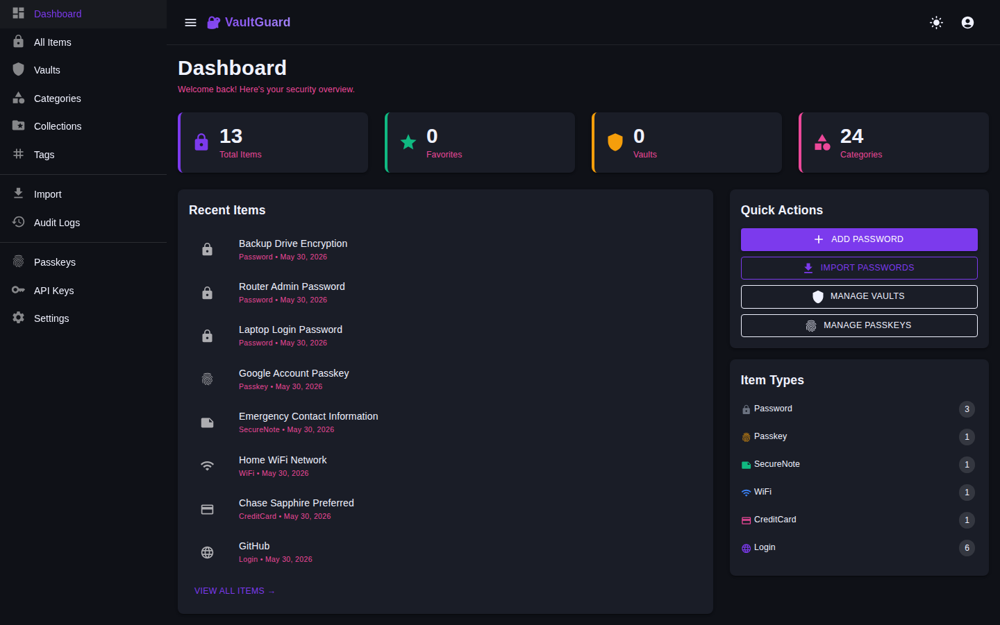
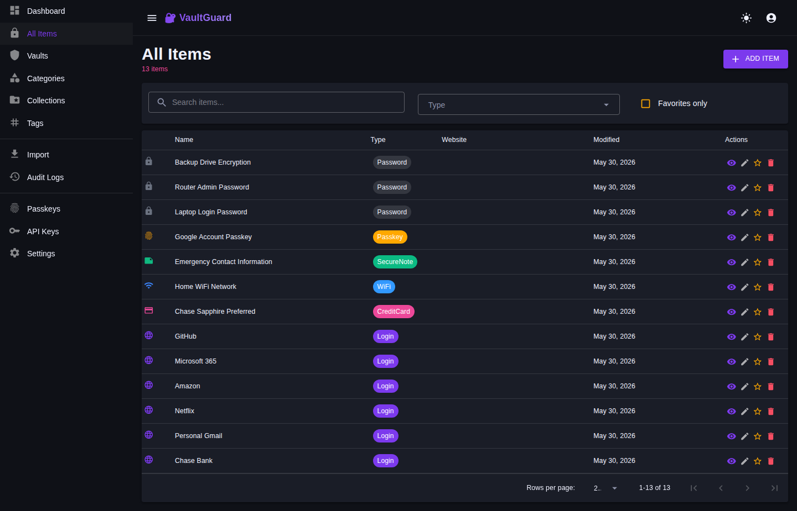
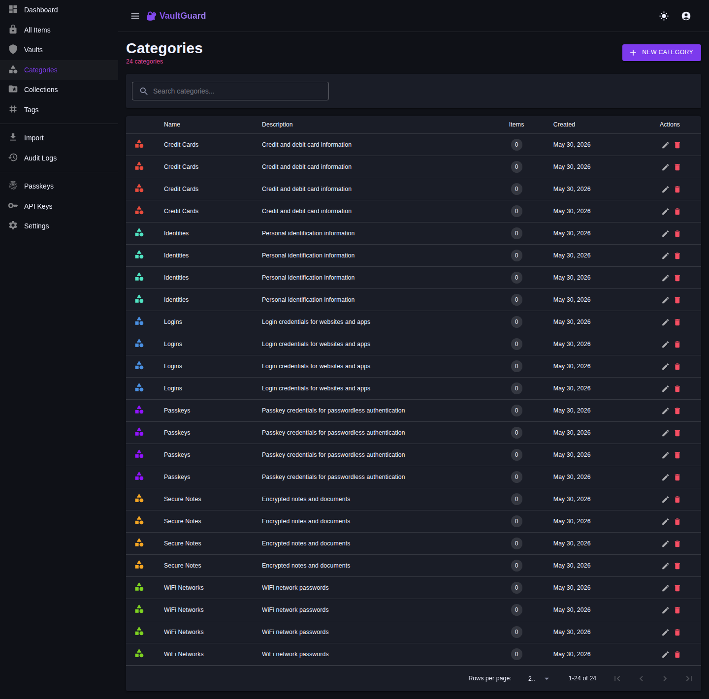
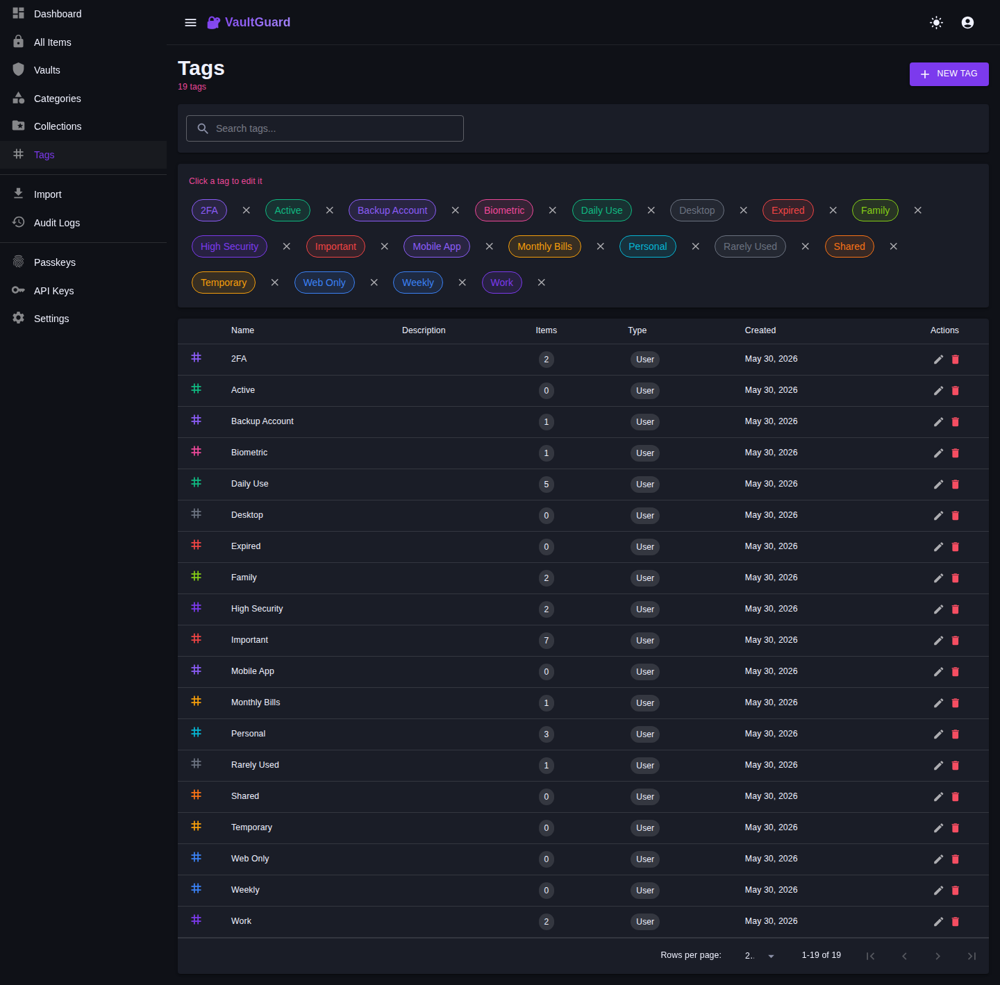
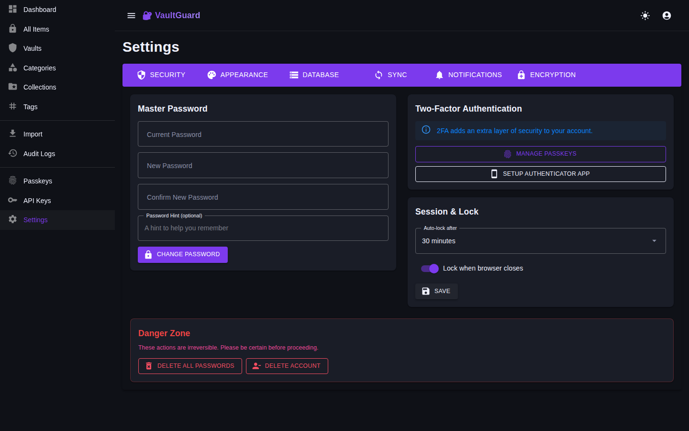
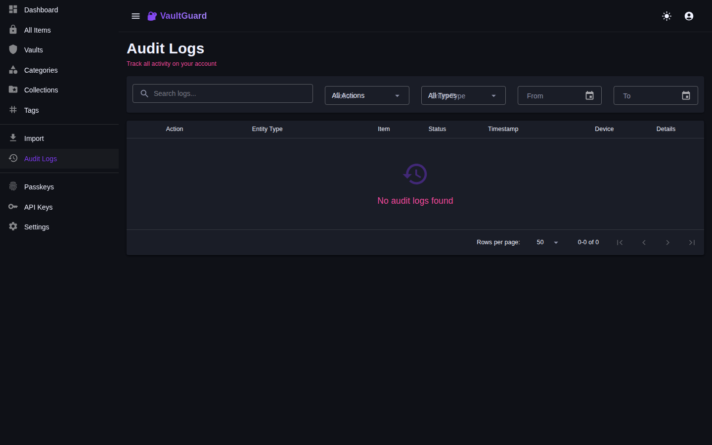
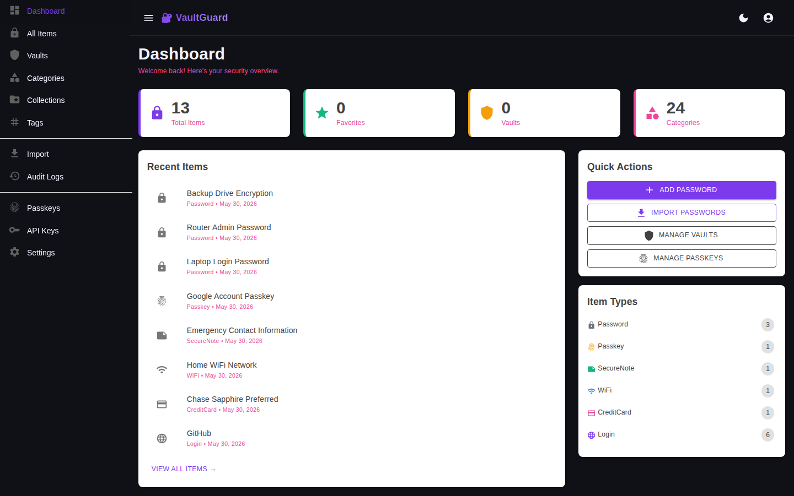
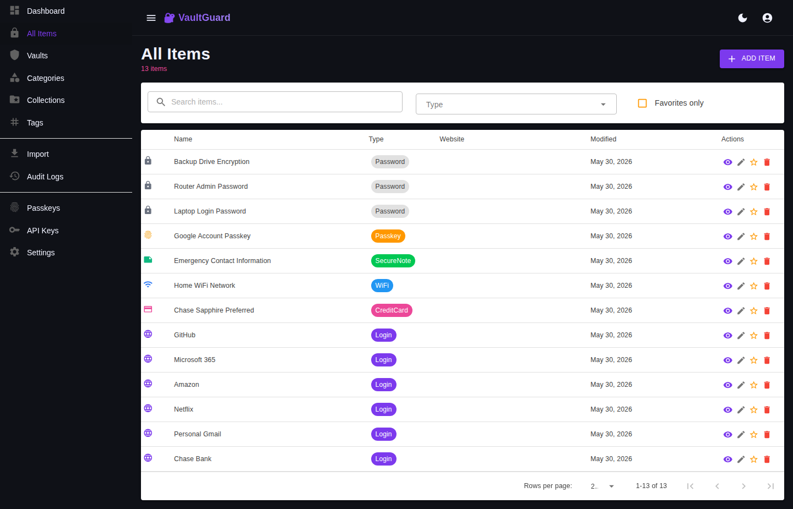
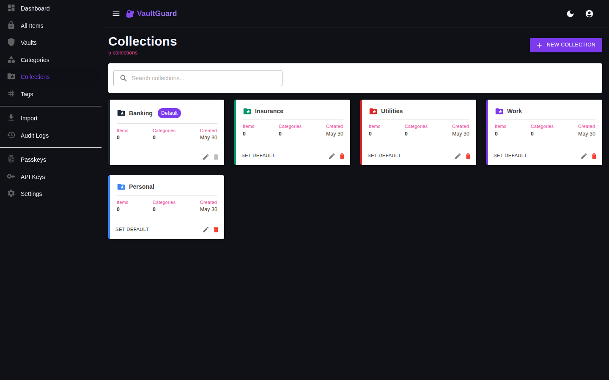
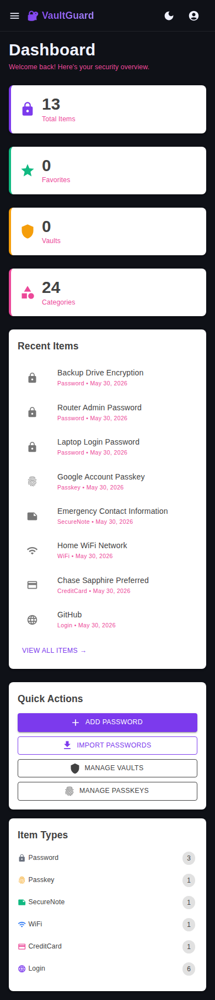

# 🔐 VaultGuard – Password Manager

A full-featured, self-hosted password manager built with **Blazor Server (.NET 10)**, **MudBlazor**, **Entity Framework Core**, and **ASP.NET Core Identity**.

---

## ✨ Features

- 🔑 **Multiple item types**: Login, Password, Passkey, SecureNote, WiFi, CreditCard
- 🏛️ **Vaults** – organize items into separate vaults
- 📂 **Categories & Collections** – flexible organization
- 🏷️ **Tags** – quick filtering and labeling
- 🌙 **Dark / Light mode** – fully themed UI
- 🔐 **Audit Logs** – track every change
- 📱 **Responsive** – works on desktop and mobile
- 🧪 **Seeded demo data** – ready to explore out of the box

---

## 📸 Screenshots

### 🖥️ Desktop – Dark Mode

| Dashboard | All Items |
|-----------|-----------|
|  |  |

| Vaults | Categories |
|--------|-----------|
|  |  |

| Collections | Tags |
|-------------|------|
|  |  |

| Settings (Security) | Audit Logs |
|---------------------|------------|
|  |  |

---

### ☀️ Desktop – Light Mode

| Dashboard | All Items |
|-----------|-----------|
|  |  |

| Collections |
|-------------|
|  |

---

### 📱 Mobile – Light Mode (390 × 844)

| Dashboard |
|-----------|
|  |

---

## 🚀 Getting Started

### Prerequisites

- [.NET 10 SDK](https://dotnet.microsoft.com/download)
- SQLite (bundled via EF Core)

### Run Locally

```bash
cd PasswordManager.Web
dotnet run
```

Navigate to `http://localhost:5169` and log in with the seeded credentials:

- **Email**: `admin@passwordmanager.local`
- **Password**: `CommonMaster123!`

---

## 🛠️ Tech Stack

| Layer | Technology |
|-------|-----------|
| Frontend | Blazor Server + MudBlazor 8 |
| Backend | ASP.NET Core (.NET 10) |
| ORM | Entity Framework Core 9 |
| Auth | ASP.NET Core Identity |
| Database | SQLite (dev) / MySQL (prod) |

---

## 📄 License

MIT
