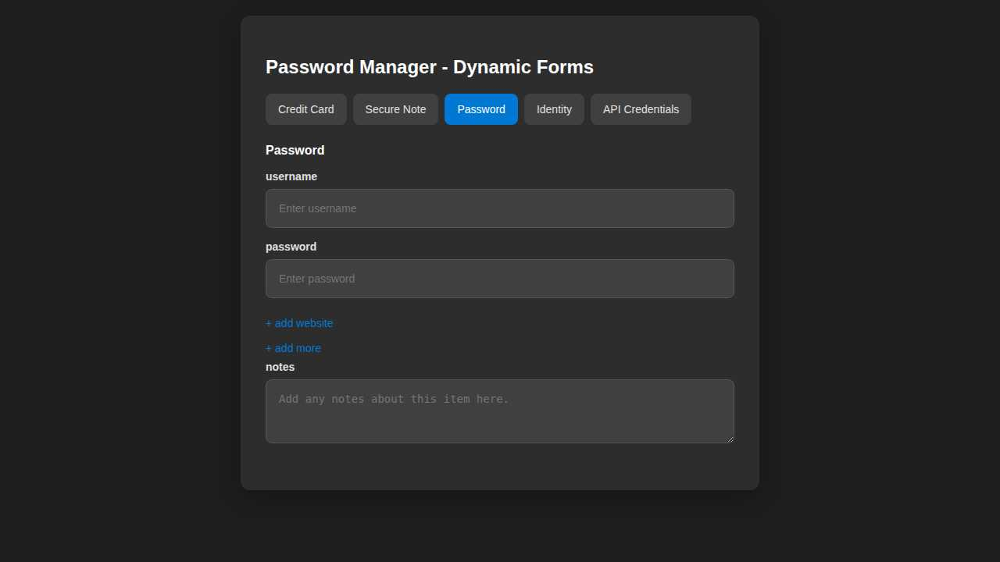
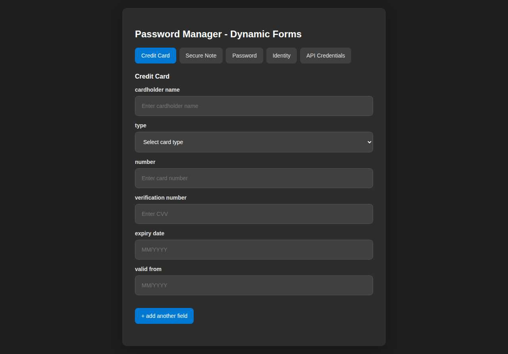
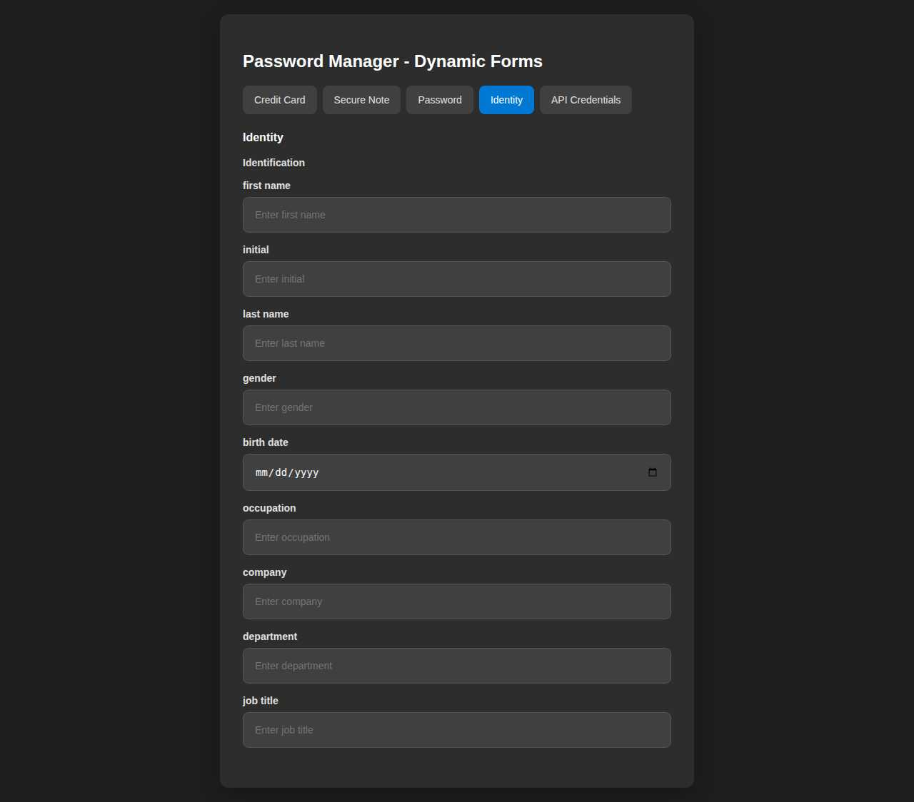
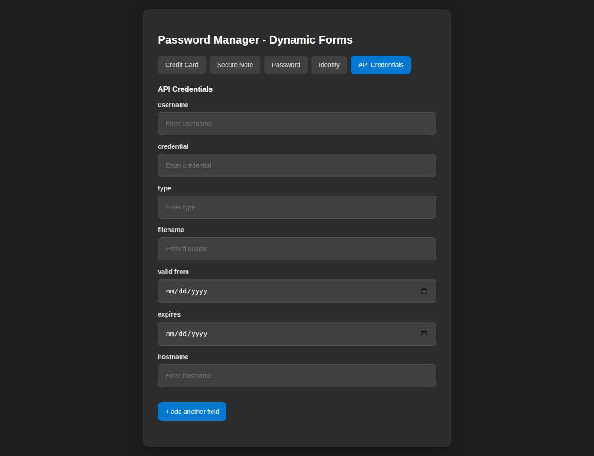
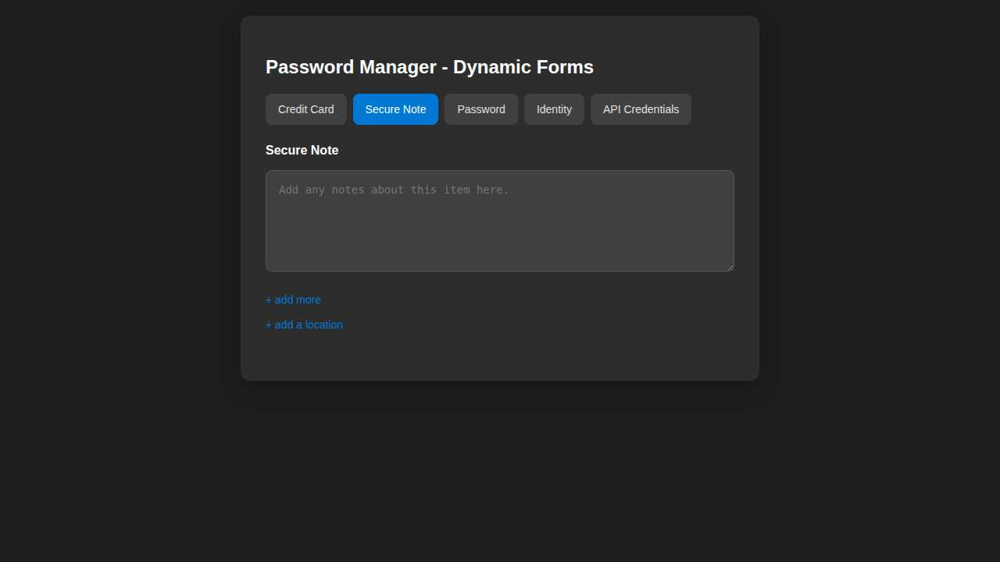

# VaultGuard.Web

A modern Blazor Server web application for password management with full theme support (Light, Dark, System), built using .NET 9 and MudBlazor components.

## Features

- **🔧 Setup Wizard**: First-run setup page for easy database configuration
- **🗄️ Database Provider Selection**: Support for SQLite, SQL Server, MySQL, PostgreSQL, and Supabase
- **⚙️ Configuration Management**: Update appsettings.json through UI
- **🔌 Connection Testing**: Test database connections before saving
- **🎨 Theme Support**: Light, Dark, and System theme modes with instant switching
- **🔐 Master Password Authentication**: Secure vault unlock using Bitwarden-compatible encryption
- **📱 Responsive Design**: Works perfectly on desktop, tablet, and mobile browsers
- **🔑 API Key Management**: Built-in interface for generating and managing API keys
- **🔍 Real-time Search**: Instant search across all password items
- **📂 Category Filtering**: Filter by categories, collections, and tags
- **📋 One-Click Copy**: Copy passwords to clipboard with visual feedback
- **✏️ Full CRUD Operations**: Create, edit, delete passwords and other items
- **🔄 Real-time Sync**: Changes sync automatically with mobile apps via API
- **🌱 Seeded Demo Data**: Fresh local databases are automatically populated with sample collections, categories, tags, and password items

## Blazor UI Screenshots

### Password Item Form


### Credit Card Form


### Identity Form


### API Credentials Form


### Secure Note Form


## Technology Stack

- **.NET 9**: Latest version of Microsoft's unified development platform
- **Blazor Server**: Server-side rendering with SignalR for real-time updates
- **MudBlazor 7.20.0**: Material Design components for rich UI
- **ASP.NET Core Identity**: User authentication and authorization
- **Entity Framework Core 9.0.0**: Database operations with multiple provider support
- **Shared Components**: Reusable UI components shared with MAUI app

## Architecture

### Project Structure

```
VaultGuard.Web/
├── Components/
│   ├── App.razor              # Root application component
│   ├── Routes.razor           # Route configuration
│   └── _Imports.razor         # Global imports
├── Properties/
│   └── launchSettings.json    # Development settings
├── wwwroot/                   # Static files
├── appsettings.json           # Configuration
├── Program.cs                 # Application startup
└── VaultGuard.Web.csproj # Project file
```

### Shared Component Integration

The web app uses components from `VaultGuard.Components.Shared`:

- **Pages**: MasterPassword, Vault, Settings, Admin pages
- **Layout**: MainLayout, NavMenu, and responsive components
- **Auth**: Authentication and authorization components

### Database Provider Support

Supports multiple database providers through Entity Framework Core:

- **SQL Server**: With ASP.NET Core Identity
- **MySQL**: Using Pomelo.EntityFrameworkCore.MySql
- **PostgreSQL**: Using Npgsql.EntityFrameworkCore.PostgreSQL
- **Supabase**: Custom authentication integration

## Getting Started

### Prerequisites

- .NET 9 SDK
- Visual Studio 2024 or JetBrains Rider
- One of the supported databases (SQL Server, MySQL, PostgreSQL, or Supabase)

### Installation

1. **Clone the repository**
   ```bash
   git clone https://github.com/dotnetappdev/VaultGuardApp.git
   cd VaultGuardApp/VaultGuard.Web
   ```

2. **Run the application**
   ```bash
   dotnet run
   ```

3. **Complete Setup Wizard**
   - On first run, you'll be redirected to `/setup`
   - Select your database provider (SQLite, SQL Server, MySQL, PostgreSQL, or Supabase)
   - Configure connection settings
   - Click "Test Connection" to verify settings
   - Click "Save & Continue" to save configuration
   - The app will restart and create the database schema

4. **Access the web app**
   - After setup, you'll be redirected to the home page
   - Register a new account or login with existing credentials
   - Enter your master password to unlock the vault
   - On a fresh local database, sample data such as **Chase Bank**, **Personal Gmail**, and **Netflix** is added automatically for demos and screenshots

### Setup Wizard

The setup wizard (`/setup`) provides an easy configuration experience:

#### Database Provider Options:

1. **SQLite** (Recommended for single user)
   - File-based database
   - No server required
   - Perfect for personal use
   - Configure database file path

2. **SQL Server**
   - Enterprise-grade database
   - Supports Windows Authentication
   - Configure host, port, database name, credentials
   - Optional SSL/TLS encryption

3. **MySQL**
   - Popular open-source database
   - Configure host, port, database name, credentials
   - Optional SSL connection

4. **PostgreSQL**
   - Advanced open-source database
   - Configure host, port, database name, credentials
   - Optional SSL connection

5. **Supabase**
   - Cloud PostgreSQL database
   - Built-in authentication
   - Configure project URL and service key

#### Configuration Features:

- **Connection Testing**: Test your database connection before saving
- **Password Encryption**: Database passwords are encrypted before storage
- **appsettings.json Update**: Configuration automatically updates application settings
- **First-Run Detection**: Setup wizard only shows on initial run

## Configuration

### Database Providers

Configure in `appsettings.json`:

#### SQL Server (Default)
```json
{
  "DatabaseProvider": "sqlserver",
  "ConnectionStrings": {
    "DefaultConnection": "Server=localhost;Database=VaultGuard;Trusted_Connection=true;TrustServerCertificate=true;"
  }
}
```

#### MySQL
```json
{
  "DatabaseProvider": "mysql",
  "ConnectionStrings": {
    "MySqlConnection": "Server=localhost;Database=VaultGuard;User=root;Password=yourpassword;Port=3306;"
  }
}
```

#### PostgreSQL
```json
{
  "DatabaseProvider": "postgresql",
  "ConnectionStrings": {
    "PostgresConnection": "Host=localhost;Database=passwordmanager;Username=postgres;Password=yourpassword"
  }
}
```

#### Supabase
```json
{
  "DatabaseProvider": "supabase",
  "ConnectionStrings": {
    "SupabaseConnection": "Host=db.xxx.supabase.co;Database=postgres;Username=postgres;Password=yourpassword;Port=5432;SSL Mode=Require;"
  }
}
```

### Authentication

The web app uses ASP.NET Core Identity for user management:

```csharp
// Program.cs
builder.Services.AddDefaultIdentity<ApplicationUser>(options =>
{
    options.SignIn.RequireConfirmedAccount = false;
    options.Password.RequireDigit = true;
    options.Password.RequiredLength = 8;
    options.Password.RequireNonAlphanumeric = false;
    options.Password.RequireUppercase = true;
    options.Password.RequireLowercase = true;
})
.AddEntityFrameworkStores<VaultGuardDbContextApp>();
```

## Features

### Master Password Authentication

The web app implements the same secure authentication flow as the mobile app:

1. User enters master password
2. PBKDF2 key derivation (600,000 iterations)
3. Vault unlocked with derived encryption key
4. Session-based key caching for performance

### API Key Management

Generate and manage API keys for programmatic access:

1. Navigate to Settings
2. Enter a descriptive name for your API key
3. Click "Generate API Key"
4. Copy the generated key (shown only once)
5. Use the key for REST API access

### Password Management

Full CRUD operations for all password item types:

- **Login Items**: Username, password, website, notes
- **Credit Cards**: Card details with secure storage
- **Secure Notes**: Encrypted text notes
- **WiFi Credentials**: Network passwords and settings

### Search and Filtering

- **Real-time Search**: Search across all fields instantly
- **Category Filtering**: Filter by predefined categories
- **Collection Filtering**: Organize items in collections
- **Tag Filtering**: Multiple tag support with colors

## Security

All cryptography runs through the shared `VaultGuard.Crypto` / `VaultGuard.Services` core, so the web app,
the standalone WPF desktop app, the API and MAUI enforce **identical** protocols. See the
[root README security section](../ReadMe.md#security) for the full description.

### Encryption

- **AES-256-GCM**: authenticated encryption for all sensitive data (random 96-bit nonce + 128-bit tag)
- **PBKDF2-HMAC-SHA256**: 600,000 iterations for key derivation (OWASP 2024), with **Argon2id** supported via
  a self-describing hash format (existing PBKDF2 vaults keep working)
- **HKDF-SHA256 key separation**: independent encryption / authentication / backup sub-keys
- **Zero-Knowledge Architecture**: server cannot decrypt data without the master password
- **Session-Based Keys**: encryption keys cached in memory and wiped after use

### Authentication

- **ASP.NET Core Identity** with **account lockout** (5 failed attempts / 15 min)
- **Rate limiting**: a global per-IP limit plus a stricter limit on authentication endpoints
- **Constant-time comparisons** for auth hashes, passcodes and 2FA/recovery codes
- **JWT Tokens** for secure API access; automatic session timeout
- **CSRF Protection**: built-in protection against cross-site request forgery

### Data Protection

- **HTTPS Only**: All communications encrypted in transit
- **Secure Cookies**: HttpOnly and Secure flags set
- **Content Security Policy**: Protection against XSS attacks
- **Input Validation**: Comprehensive input sanitization

## Development

### Building

```bash
dotnet build
```

### Running in Development

```bash
dotnet run --environment Development
```

### Running Tests

```bash
dotnet test
```

### Adding New Features

1. Create components in `VaultGuard.Components.Shared` for shared functionality
2. Add web-specific components in `VaultGuard.Web/Components`
3. Update navigation in shared `NavMenu.razor`
4. Add necessary services to DI container in `Program.cs`

## Deployment

### IIS Deployment

1. Publish the application:
   ```bash
   dotnet publish -c Release -o ./publish
   ```

2. Configure IIS with ASP.NET Core Hosting Bundle

3. Set up database connection string in production `appsettings.json`

### Docker Deployment

```dockerfile
FROM mcr.microsoft.com/dotnet/aspnet:9.0 AS base
WORKDIR /app
EXPOSE 80
EXPOSE 443

FROM mcr.microsoft.com/dotnet/sdk:9.0 AS build
WORKDIR /src
COPY ["VaultGuard.Web/VaultGuard.Web.csproj", "VaultGuard.Web/"]
RUN dotnet restore "VaultGuard.Web/VaultGuard.Web.csproj"
COPY . .
WORKDIR "/src/VaultGuard.Web"
RUN dotnet build "VaultGuard.Web.csproj" -c Release -o /app/build

FROM build AS publish
RUN dotnet publish "VaultGuard.Web.csproj" -c Release -o /app/publish

FROM base AS final
WORKDIR /app
COPY --from=publish /app/publish .
ENTRYPOINT ["dotnet", "VaultGuard.Web.dll"]
```

## Performance

- **Server-Side Rendering**: Blazor Server for optimal performance
- **SignalR**: Real-time updates without page refreshes
- **Lazy Loading**: Components loaded on-demand
- **Caching**: Intelligent caching strategies
- **Debounced Search**: Optimized search performance

## Browser Support

- **Chrome**: Latest version
- **Firefox**: Latest version
- **Safari**: Latest version
- **Edge**: Latest version
- **Mobile Browsers**: iOS Safari, Android Chrome

## Contributing

1. Fork the repository
2. Create a feature branch
3. Make your changes
4. Add tests for new functionality
5. Submit a pull request

## License

This project is licensed under the MIT License - see the [LICENSE](../LICENSE) file for details.

## Support

- Email: support@passwordmanager.dev
- Issues: [GitHub Issues](https://github.com/dotnetappdev/VaultGuardApp/issues)
- Discussions: [GitHub Discussions](https://github.com/dotnetappdev/VaultGuardApp/discussions)

---

Built with .NET 9, Blazor Server, and MudBlazor
