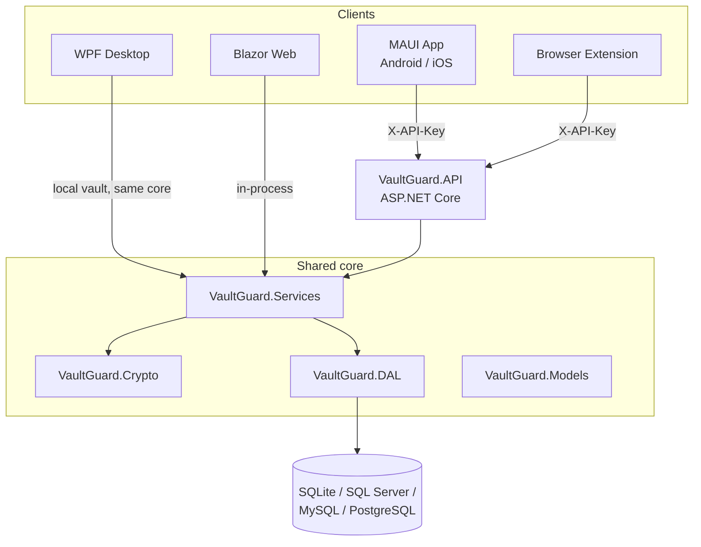

# Architecture

## Project layout

VaultGuard is a single .NET solution (`VaultGuard.sln`) split into a shared core and one project per
front-end. Front-ends never talk to each other directly - they all sit on the same core libraries.

```
VaultGuard.Models/             Shared models and DTOs
VaultGuard.Crypto/              Key derivation and AES-256-GCM encryption
VaultGuard.DAL/                 Data access layer (EF Core)
VaultGuard.DAL.{SqlServer,MySql,Postgres}/   Database provider plugins
VaultGuard.Services/            Business logic (vaults, items, backups, TOTP, passkeys, permissions)
VaultGuard.Imports/              Import framework + per-vendor plugins (1Password, Bitwarden, ...)
VaultGuard.API/                 ASP.NET Core Web API
VaultGuard.Web/                 Blazor Server web app
VaultGuard.Components.Shared/    Shared Blazor UI - also hosted inside the MAUI app (Blazor Hybrid)
VaultGuard.WPF/                 Windows desktop app
VaultGuard.App/                 MAUI mobile app (Android / iOS / Windows)
VaultGuard.BrowserExtension/     Cross-browser extension + native messaging host
```

## How the pieces fit together



**WPF and the Blazor web app** run the shared `Services`/`DAL`/`Crypto` core **in-process** - there's no
network hop between the UI and the business logic; the web app's "server" is just where that process
happens to run.

**Mobile and the browser extension** talk to `VaultGuard.API` over HTTP, authenticating with an
[API key](/api/reference#authentication) issued from the web app. The API hosts the exact same
`Services`/`DAL`/`Crypto` core, so a request handled by the API goes through identical validation and
encryption code paths as a request handled locally by WPF or the web app.

## Data flow for a typical read

1. Client asks for a vault item (in-process call for WPF/Web, or `GET /api/passworditems/{id}` for
   mobile/extension via the API).
2. `VaultGuard.Services` checks the caller's [permissions](/api/reference#authorization) for that
   resource.
3. `VaultGuard.DAL` (EF Core) loads the encrypted row from whichever database provider is configured.
4. `VaultGuard.Crypto` decrypts sensitive fields using a key derived from the caller's master password -
   which the server/API **never has**; decryption of secrets only happens against a session key
   established at sign-in (see [Security Model](/guide/security)).
5. The client renders it - same shape, same fields, on every platform.

## Database providers

SQLite is the default (zero setup, one file). `VaultGuard.DAL.SqlServer`, `VaultGuard.DAL.MySql` and
`VaultGuard.DAL.Postgres` are drop-in alternatives configured from Settings - the rest of the stack
(`Services`, API contracts, UI) is provider-agnostic.

## Testing

- `VaultGuard.BackEnd.Tests` (NUnit) - services, controllers, crypto, seeding; the bulk of the unit/
  integration suite, instrumented with [Allure](https://dotnetappdev.github.io/PasswordManagerApp/allure-report/) for dashboarded results.
- `VaultGuard.Tests.QrLogin`, `VaultGuard.Tests.OTP` (xUnit) - passkeys, QR login, OTP/TOTP.
- `VaultGuard.Tests.Playwright` (MSTest + Playwright) - drives the actual Blazor web app headlessly; also
  what generates the [screenshots](/platforms/web) on this site.

See [`docs/TESTING.md`](https://github.com/dotnetappdev/PasswordManagerApp/blob/devmain/docs/TESTING.md)
in the repository for the full test-running guide.
